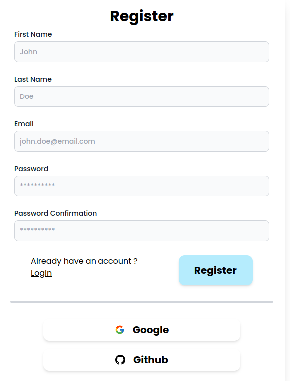
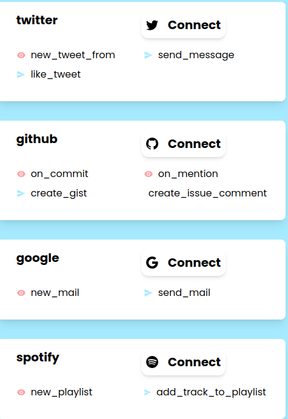
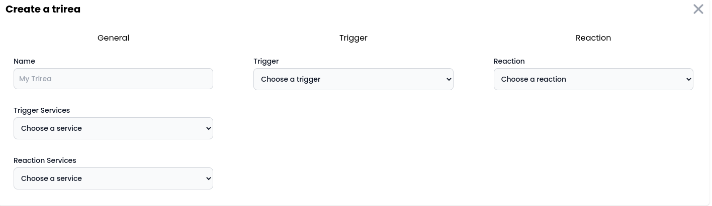
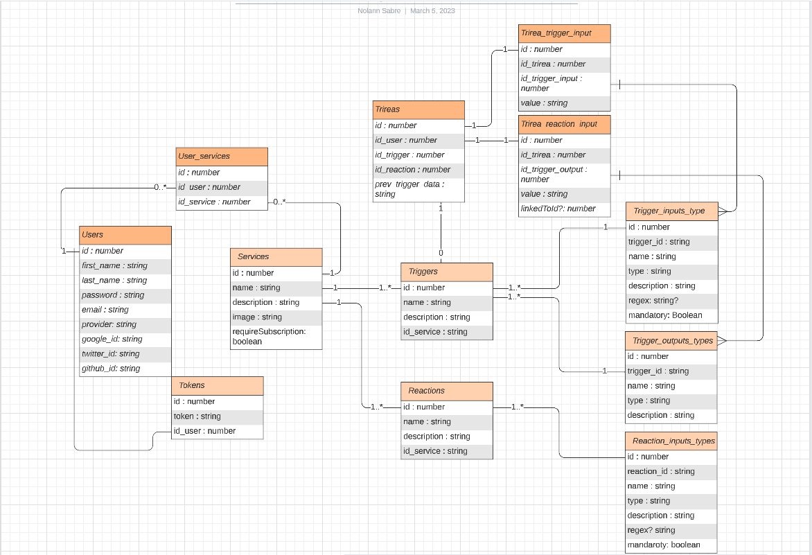

# AREA

<h1 align="center">
  
   
</h1>

<h3 align="center">IFTTT clone</h3>

    
    
    
    

## Introduction :checkered_flag:

AREA is a web and mobile platform that allows to connect different services to each other in order to perform certain actions. For example you can decide to connect Spotify and Gmail in order to send an email when an artist releases a new music, but you can also make an automatic tweet when your favorite content creator releases a video on the YouTube platform. AREA offers the possibility to connect directly with different providers like Github, Google & Twitter

## How to use ? :bulb:

First, you need to go to the [web platform](https://area-epitech-front.vercel.app/) or download the AREA mobile application. Once on the application you have the choice between logging in or registering, assuming you don't have an account on our platform yet, you have to fill in this form:

     
  
   
   

Once registered, you will be redirected to the dashboard, this is the place from where you can manage all your trirea. Your trireas are the combination of an action and a reaction. For the moment you don't have any Trirea, to create your first Trirea you have to select the services you are interested in, to do this go to the Service page accessible from the button you will see on the top right.
You should find yourself on a page like the one below with a list of different services, some services need to be connected to the provider like Google while others like the Time module just need to be followed.

     
  
   
   

you can go back to the dashboard and create your first Trirea, you will have to fill in a Name, which has no particular importance and is only used to differentiate your Trirea, as well as a Trigger and a Reaction that will be performed when the trigger is activated.

     
  
   
   

> Damn, let's have fun now, **Connect everything, everywhere, everywhen !:fire:**

## Contributing :wrench:

We are an open source project, in that sense we are open to contribution. We advise readers to contribute in order to take control of new technologies and participate in a project that aims to change the way people use technology.

Read the [CONTRIBUTING](./CONTRIBUTING.md) guide for more information !

## Architecture :factory:

The AREA is a complex project that requires the use of different technologies to successfully address the issue.

We divided the project into two distinct categories, the back-end and the front-end, from there we decided to think about the technologies to be used

The whole project is containerized, the back-end is deployed on a VPS while the front-end is deployed on Vercel

### Database :bookmark_tabs:

The database is a postgre SQL designated to allow authentication via the oauth flow but also to allow the actions to be chained with their output and the inputs of the reactions

     
  
   
   

### Back-end :gear:

The back-end is in charge of all the logic of the project, from authentication to the execution of trireas. For this purpose we had to choose a resilient technology stack, we decided to choose Typescript with NODE.js for the project.

#### Authentication :lock:

Authentication is an important part, there are 1000 ways to make an authentication system. We decided to push the technique to the maximum by creating a system of acces_token and refresh_token which allows the user to not have to re-connect each time. The tokens are stored in the cookies in HttpOnly which prevents the exploitation of XSS vulnerability by potential malicious users. The tokens are json web tokens with a secret kept in the environment

#### API Rest :electric_plug:

Our back-end provides a rest API to communicate with the front-end, our rest API uses the Express framework and uses Zod for its validation schemes, Express allows us to easily configure our routes and add middleware without difficulty.

All routes are available in the [ROUTES](./ROUTES.md) The mobile client was the most complicated part for the front-end, especially at the OAUTH level or the redirections or often the need to open a window in a browser which posed a problem but was able to be solved by our team .

The application allows you to perform all the actions available on the web platform directly from the applicationfile

#### Jobs Manager :construction_worker:

The Jobs manager is the most exotic part of the project, succeeding in linking different services is not an easy task.

For this, the tokens of the different providers are stored in the database in order to allow the application to communicate with the different providers such as Google, Github, Spotify, etc.

Depending on the action and the reaction we are able to build the path to the file containing the action or reaction code, then we are able to dynamically import this code in order to perform the action.

All this is done every 5 seconds thanks to a cron job.

### Front-end :art:

The front-end is the visible part of the project, the one that allows the user to interact with our application. To do this, a Figma model was first produced with a clear definition of the objectives of both web and mobile clients.

Then we chose the technology stack, i.e. Typescript, React, tailwind for the web and React-native for the mobile, this allowed us to have similar code between the web and the mobile and to use the same language as the back -end.

#### Web Client :desktop_computer:

The web client brings to the user the possibility of using the application from a computer for example.

We worked with Redux Toolkit to manage app states.

#### Mobile Client :iphone:

The mobile client was the most complicated part for the front-end, especially at the OAUTH level or the redirections or often the need to open a window in a browser which posed a problem but was able to be solved by our team .

The application allows you to perform all the actions available on the web platform directly from the application

## License :book:

© 2022-2023 [MMAN](https://www.youtube.com/watch?v=Py00TertFmw)

Licensed under the [MIT license](https://opensource.org/licenses/MIT) ([`LICENSE-MIT`](LICENSE-MIT)). See the [`COPYRIGHT`](COPYRIGHT) file for more details.

`SPDX-License-Identifier: (MIT)`

## Core maintainers :sunglasses:

- [Mikaël Vallenet](https://github.com/Mikatech)
- [Maxime Premont](https://github.com/MaximePremont)
- [Nolann Sabre](https://github.com/Nolann71)
- [Ahmed Abouelleil-sayed](https://github.com/AhmedFr)

---

made with a lot of :heart: and a bit of :brain: